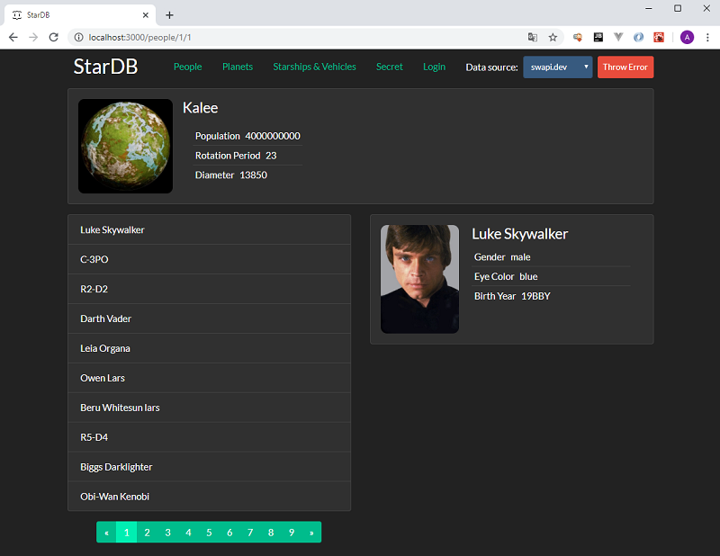

# StarDB
Второе react-приложение написанное в рамках учебного курса ["React + Redux - Профессиональная Разработка"](https://www.udemy.com/course/pro-react-redux/).

Представляет из себя базу знаний про персонажей, планеты, звездные корабли и прочую технику из саги "Звездные войны". Является примером приложения, работающего с API. Имеет ряд функциональных особенностей по сравнению с версией, создаваемой в рамках курса. В частности, добавлена пагинация в разделах и реализовано получение данных из трех разных источников - сервера swapi.dev, локального json-сервера и с репозитория на github.com.

# Example

